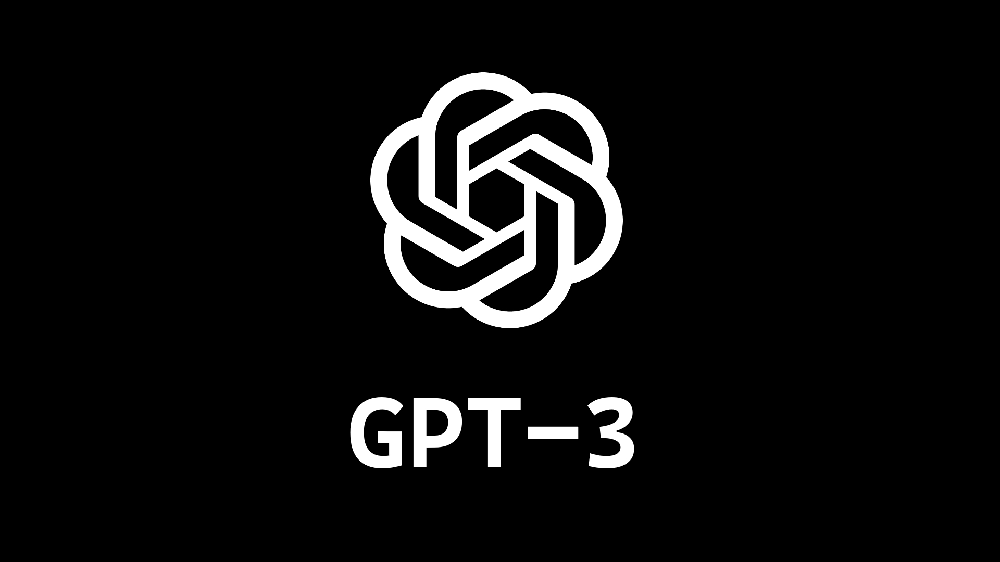

# AIShout

AISHout is an open-source and efficient report generator based on OpenAI Whisper and GPT-3. The core of the application is written in Python and uses PyTorch as a deep learning framework. The mobile application is a flutter project that make use of the final python pipeline.

This project is in a beta version. There is no stable release yet. 

This project is a submission to the [OpenAI Hackathon](https://lablab.ai/event/openai-whisper-gpt3-codex-dalle2-hackathon). 

## Description
our goal is to make it easier for you to create a meeting minute based on the original discussion and thus make the note taking more special. 

## Screenshots

## Libraries/tools

### Whisper

### GPT3

